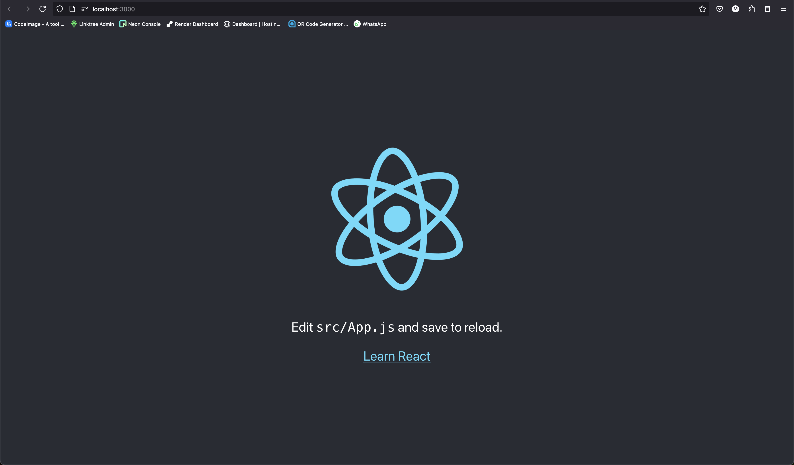

# Crear el proyecto

### `npx create-react-app todo-app`

# Navegar al proyecto

### `cd ./todo-app`

## Abrir el proyecto con un editor de codigo (vscode, vs, sublimetext, etc)

# Ejecutar el proyecto

### `npm start`

La aplicacion ahora se estara ejecutando en el puerto 3000 de tu localhost
Abre [http://localhost:3000](http://localhost:3000) para mirarlo en tu navegador.



# En el editor de codigo de tu preferencia, navegar al archivo [App.js](./src/App.js), que esta dentro de la carpeta src.

```js
import React, { useState } from "react"; // Importamos React y useState desde 'react'
import "./App.css"; // Importamos los estilos del archivo App.css

function App() {
  // Definimos el componente principal App

  const [tasks, setTasks] = useState([
    {
      task: "Learn React", // Tarea 1
      description: "Learn the basics of React", // Descripción de la tarea 1
      isCompleted: false, //TODO: Agregar el codigo para que se pueda marcar como completada
    },
  ]); // useState para manejar la lista de tareas
  const [newTask, setNewTask] = useState(""); // useState para manejar la nueva tarea
  const [newDescription, setNewDescription] = useState(""); // useState para manejar la descripción de la nueva tarea
  const [editIndex, setEditIndex] = useState(-1); // useState para manejar el índice de la tarea que se está editando, -1 significa que no se está editando porque en JS los índices empiezan en 0

  // Función para manejar el cambio en el input de tarea
  const handleTaskChange = (e) => {
    //e.target.value | Obtiene el valor del input
    setNewTask(e.target.value); // Actualiza el estado 'newTask' con el valor del input de tarea
  };

  // Función para manejar el cambio en el input de descripción
  const handleDescriptionChange = (e) => {
    //e.target.value | Obtiene el valor del input
    setNewDescription(e.target.value); // Actualiza el estado 'newDescription' con el valor del input de descripción
  };

  // Función para agregar o editar una tarea
  const handleAddOrEditTask = () => {
    // Verifica que los campos no estén vacíos
    if (newTask.trim() !== "" && newDescription.trim() !== "") {
      // .trim() elimina los espacios en blanco al inicio y al final de una cadena
      // Si no estamos editando, agregamos una nueva tarea
      if (editIndex === -1) {
        // Agrega la nueva tarea al array de tareas
        // los tres puntos (...) se utilizan para copiar el array de tareas existente y agregar la nueva tarea al final
        setTasks([...tasks, { task: newTask, description: newDescription }]);
      } else {
        // Si estamos editando, actualizamos la tarea existente
        //.map recorre cada elemento del array y devuelve un nuevo array con los elementos modificados
        const updatedTasks = tasks.map((item, index) => {
          if (index === editIndex) {
            return { task: newTask, description: newDescription };
          } else {
            return item;
          }
        });
        setTasks(updatedTasks);
        setEditIndex(-1); // Reiniciamos el índice de edición
      }
      setNewTask(""); // Limpia el input de tarea después de agregarla o editarla
      setNewDescription(""); // Limpia el input de descripción después de agregarla o editarla
    }
  };

  // Función para eliminar una tarea
  const handleDeleteTask = (index) => {
    // Filtra las tareas para eliminar la tarea seleccionada. Se utiliza .filter() que crea un nuevo array sin la tarea que queremos eliminar.
    // filter() recorre cada elemento del array y solo mantiene los elementos que cumplen con la condición especificada.
    const updatedTasks = tasks.filter((item, i) => i !== index);
    setTasks(updatedTasks); // Actualiza la lista de tareas sin la tarea eliminada
  };

  // Función para seleccionar una tarea para editar
  const handleEditTask = (index) => {
    setEditIndex(index); // Establece el índice de la tarea que se va a editar
    setNewTask(tasks[index].task); // Llena el input de tarea con el valor de la tarea seleccionada
    setNewDescription(tasks[index].description); // Llena el input de descripción con el valor de la descripción seleccionada
  };

  // Función para marcar una tarea como completada
  const handleToggleComplete = (index) => {
    // Queremos actualizar la lista de tareas cuando se marca una tarea como completada.
    // Primero, usamos el método map para crear una nueva lista de tareas. ¿Recuerdas cómo funciona el método map?
    //TODO: Agregar el código para marcar una tarea como completada
  };

  return (
    <div className="App">
      {/* Contenedor principal */}
      <header className="App-header">
        {/* Encabezado de la aplicación */}
        <h1>ToDo List</h1>

        {/* Input para agregar o editar una tarea */}
        <input
          type="text"
          value={newTask}
          onChange={handleTaskChange}
          placeholder="Add or edit task"
        />

        {/* Input para agregar o editar la descripción de una tarea */}
        <input
          type="text"
          value={newDescription}
          onChange={handleDescriptionChange}
          placeholder="Add or edit description"
        />

        {/* Botón para agregar o editar la tarea */}
        <button className="primary" onClick={handleAddOrEditTask}>
          {editIndex === -1 ? "Add Task" : "Update Task"}
        </button>

        {/* Tabla para mostrar la lista de tareas */}
        <table>
          <thead>
            <tr>
              <th>#</th> {/* Columna para el número de tarea */}
              <th>Task</th> {/* Columna para la descripción de la tarea */}
              <th>Description</th>
              {/* Columna para la descripción de la tarea */}
              <th>Completed</th> {/* Columna para la descripción de la tarea */}
              <th>Actions</th>
              {/* Columna para las acciones de editar o eliminar */}
            </tr>
          </thead>
          <tbody>
            {/* Mapeamos las tareas para mostrarlas en la tabla */}
            {tasks.map((item, index) => (
              <tr key={index}>
                <td>{index + 1}</td> {/* Muestra el número de tarea */}
                <td>{item.task}</td> {/* Muestra la descripción de la tarea */}
                <td>{item.description}</td>
                {/* Muestra la descripción de la tarea */}
                {/*TODO: Agregar otro <td></td> para mostrar si esta completada la tarea */}
                <td></td>
                <td>
                  {/* Botón para marcar una tarea como completada */}
                  <button className="success" onClick={() => handleToggleComplete(index)}>
                    Complete
                  </button>
                  {/* Botón para editar la tarea */}
                  <button className="primary" onClick={() => handleEditTask(index)}>Edit</button>
                  {/* Botón para eliminar la tarea */}
                  <button className="danger" onClick={() => handleDeleteTask(index)}>
                    Delete
                  </button>
                </td>
              </tr>
            ))}
          </tbody>
        </table>
      </header>
    </div>
  );
}

export default App; // Exportamos el componente App para que pueda ser usado en otros archivos
```


# Aqui esta el codigo para marcar como completada la tarea

```js
const handleToggleComplete = (index) => {
    // Queremos actualizar la lista de tareas cuando se marca una tarea como completada.
    // Primero, usamos el método map para crear una nueva lista de tareas. ¿Recuerdas cómo funciona el método map?
    
    const updatedTasks = tasks.map((item, i) => {
      
      // Aquí estamos dentro de la función map. Estamos iterando sobre cada tarea.
      // Necesitamos verificar si el índice de la tarea actual (i) coincide con el índice de la tarea que queremos marcar como completada.
      
      if (i === index) {
        // ¡Correcto! Si los índices coinciden, eso significa que encontramos la tarea que queremos actualizar.
        // Ahora, ¿cómo creamos una nueva tarea con el estado de "completed" invertido?
        
        return {
          ...item, // Esto copia las propiedades actuales de la tarea, pero queremos cambiar una propiedad en particular.
          completed: !item.completed // Aquí estamos cambiando el valor de "completed" al opuesto (true a false, o false a true).
        };
      }
      
      // Si los índices no coinciden, significa que esta no es la tarea que queremos actualizar.
      // Entonces, ¿qué debemos devolver en este caso?
      
      return item; // Mantenemos la tarea sin cambios.
    });
  
    // Finalmente, actualizamos el estado de "tasks" con la nueva lista actualizada.
    setTasks(updatedTasks); // ¿Recuerdas cómo funciona setTasks? Aquí es donde actualizamos el estado.
  };
  ```# webos
# webos
